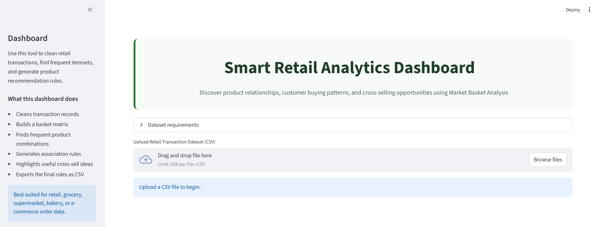
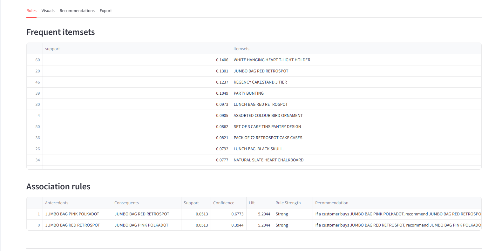
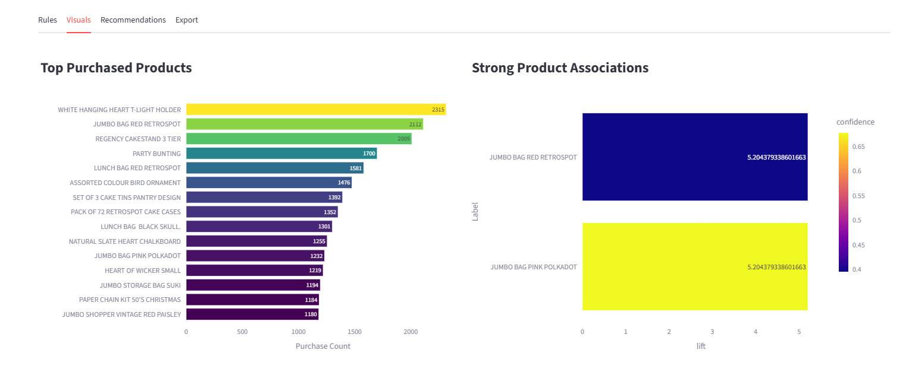

# 🛒 Smart Retail Analytics & Recommendation Platform
## 📸 Application Preview

### 🏠 Homepage

---

### 📊 Analytics Dashboard

---

### 📈 Visualizations

---
## 📌 Project Overview

Smart Retail Analytics & Recommendation Platform is an intelligent retail analytics system built using Python and Streamlit that performs automated Market Basket Analysis on transactional retail datasets.

The platform discovers hidden purchasing patterns, generates association rules, identifies frequently bought-together products, and provides business-driven recommendations to support cross-selling, inventory optimization, and customer behavior analysis.

This project transforms raw retail transaction data into actionable business insights through interactive analytics and visualization.

---

# 🚀 Key Features

## ✅ Smart Dataset Handling

- Upload retail transaction datasets dynamically
- Supports multiple retail and grocery dataset formats
- Automatic dataset preview and summary
- Flexible transaction/product column selection

## ✅ Automated Data Cleaning

- Handles missing values
- Removes duplicate records
- Filters invalid quantities
- Preprocesses transaction data automatically

## ✅ Market Basket Analysis

- Basket matrix transformation
- Apriori Algorithm implementation
- Frequent itemset generation
- Association rule mining

## ✅ Intelligent Product Recommendation System

- Product association discovery
- Cross-selling recommendation generation
- Strong rule filtering using lift and confidence
- Automated recommendation insights

## ✅ Interactive Retail Analytics Dashboard

- Modern Streamlit dashboard interface
- Rules, Visuals, Recommendations, and Export sections
- Dynamic dataset metrics
- User-friendly analytics workflow

## ✅ Business-Oriented Visualizations

- Top purchased products analysis
- Strong product association charts
- Product relationship visualization
- Retail trend analysis

## ✅ Business Insights Generation

- Cross-selling opportunities
- Product placement strategies
- Inventory optimization insights
- High-demand product identification

## ✅ Performance Optimization

- Sparse matrix optimization
- Product filtering for large datasets
- Memory-efficient Apriori execution
- Large dataset handling support

## ✅ Downloadable Outputs

- Export association rules as CSV
- Download processed analytics results

---

# 🧠 Technologies Used

| Technology | Purpose                     |
| ---------- | --------------------------- |
| Python     | Core Programming            |
| Pandas     | Data Processing             |
| NumPy      | Numerical Operations        |
| Streamlit  | Interactive Dashboard       |
| Matplotlib | Data Visualization          |
| MLxtend    | Apriori & Association Rules |
| VS Code    | Development Environment     |

---

# 📂 Supported Dataset Types

The platform supports:

* Retail Transaction Datasets
* Grocery Store Transactions
* Bakery/Cafe Sales Data
* E-commerce Purchase Data
* Supermarket Basket Datasets

---

# 📋 Required Dataset Structure

Minimum required columns:

| Column Type    | Description                  |
| -------------- | ---------------------------- |
| Transaction ID | Unique order/bill identifier |
| Product Column | Purchased product/item       |

Optional:

| Optional Column | Description               |
| --------------- | ------------------------- |
| Quantity Column | Number of purchased items |

---

# 📊 Example Dataset Format

| Order_ID | Product_Name | Quantity |
| -------- | ------------ | -------- |
| ORD1001  | Coffee       | 2        |
| ORD1001  | Cake         | 1        |
| ORD1002  | Bread        | 3        |
| ORD1002  | Butter       | 1        |

---

# ⚙️ Project Workflow

Retail Transaction Dataset
↓
Data Cleaning & Preprocessing
↓
Basket Matrix Transformation
↓
Frequent Itemset Mining
↓
Association Rule Generation
↓
Strong Rule Filtering
↓
Recommendation Generation
↓
Visualization & Business Insights
↓
Downloadable Reports

---

# 📈 Dashboard Capabilities

The dashboard provides:

* Dataset Preview
* Dataset Metrics
* Frequent Itemsets
* Strong Association Rules
* Product Recommendation Tables
* Top Purchased Product Analysis
* Product Association Visualizations
* Business Insights Generation
* Downloadable Analytics Reports

---

# 💡 Sample Business Insights

* Frequently bought-together products improve cross-selling opportunities.
* High-lift products should be strategically placed nearby.
* Strong associations help create combo offers.
* Popular products require inventory optimization.
* Product recommendations can increase basket size.

---

# ⚡ Scalability & Optimization

To improve performance on large retail datasets, the platform implements:

* Top-product filtering
* Sparse matrix optimization
* Memory-efficient Apriori execution
* Adjustable support thresholds
* Reduced itemset dimensionality

---

# 📁 Output Files

| File                | Description                 |
| ------------------- | --------------------------- |
| strong_rules.csv    | Generated association rules |
| cleaned_dataset.csv | Preprocessed retail dataset |

---

# 🔮 Future Enhancements

* FP-Growth Algorithm Integration
* AI-generated Business Insights
* Interactive Plotly Visualizations
* Customer Segmentation
* Real-time Recommendation Engine
* Power BI Integration
* Time-Series Retail Analytics
* Cloud Deployment

---

# 🎯 Project Impact

This platform helps retail businesses:

* Understand customer purchasing behavior
* Improve product recommendations
* Optimize inventory planning
* Enhance cross-selling strategies
* Increase customer engagement
* Support data-driven decision making

---

# ✅ Conclusion

The Smart Retail Analytics & Recommendation Platform successfully transforms retail transaction datasets into meaningful business intelligence using Market Basket Analysis and Association Rule Mining techniques.

The platform combines data preprocessing, scalable analytics, intelligent recommendations, and interactive visualization into a professional retail analytics solution suitable for modern business intelligence applications.
